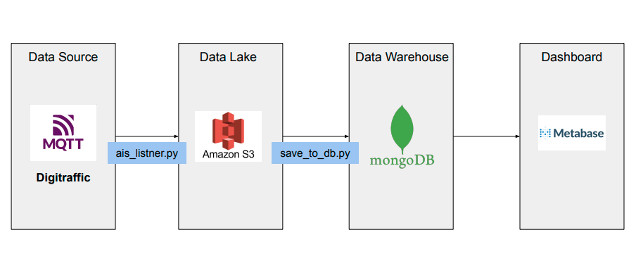
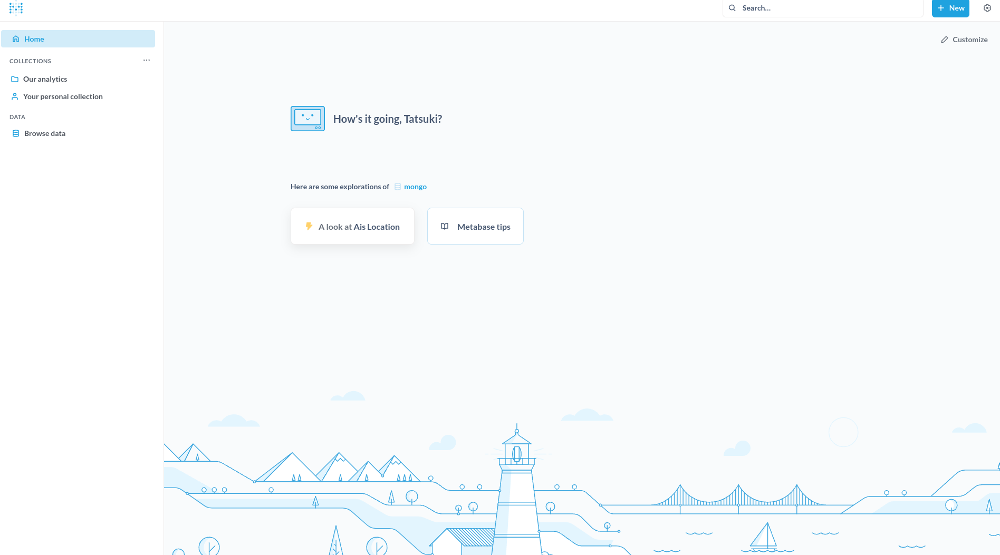
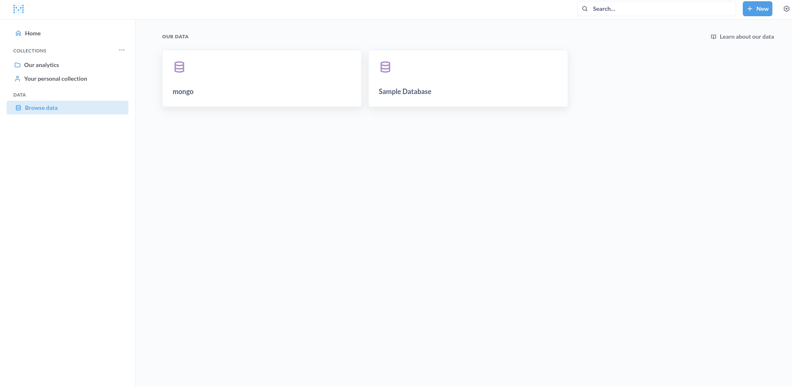
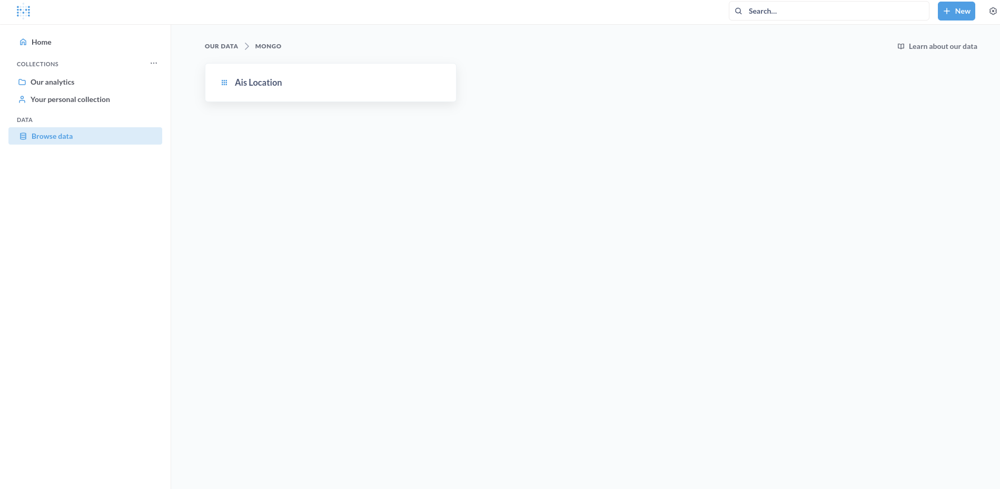
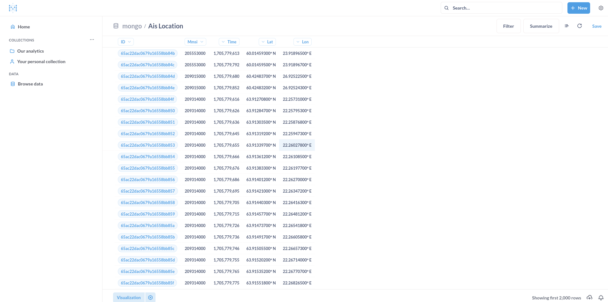
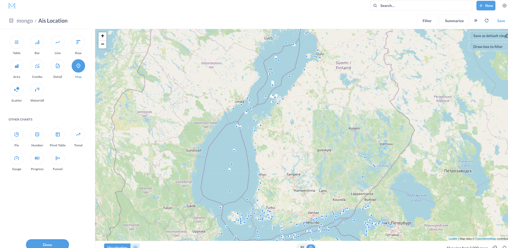
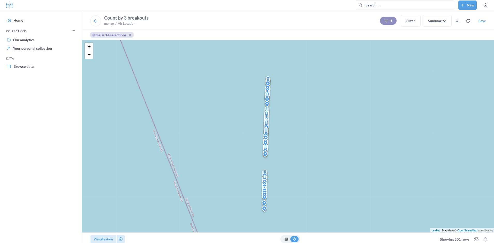

# vessel_tracker
This is thevery simple data pipeline application which get Marine traffic data from Digitraffic API(https://www.digitraffic.fi/en/marine-traffic/) and show it on metabase dashboard.

## Architecture



### Data Source
Digitraffic offeres MQTT broker which publish AIS data of the ships in Finland. `ais_listner.py` script subscribe to the topic `vessels-v2/+/location` to track all locations.

### Data Lake
AWS S3 for a data lake because of its virtually unlimited scalability and high durability. In this application it actually use Localstack. Localstack is the AWS service emulator that runs on the local machine, so you can test your code using AWS service on your local machine without changing code.
If you have AWS account and want to use it, please comment out lines for Localstack from `docker-compose.yml`

### Data WArehouse
MongoDB is used for Data Warehouse because it's fast and easy to set up.

### Dashboard
Metabase is used for data visualization because it is free and easy to use.

## Prerequisites
- docker-compose
- crontab

## How to run
### 1. create `.env` file
create `.env` file in root of this repository
```
$ touch .env
```

```
# AWS settings
AWS_URL=http://localstrack:4566       # if you use real AWS please set AWS URL
AWS_ACCESS_KEY_ID=<AWS ACCESS KEY ID>
AWS_SECRET_ACCESS_KEY=<AWS SECRET ACCESS KEY>
AWS_BUCKET_NAME=<AWS BUCKET NAME>

# Localstack settings
SERVICES=s3
DEBUG=1
AWS_DEFAULT_REGION=<AWS REGION> # doesn't matter any region

# DIGITRAFIC settings
APP_NAME=<APP_NAME>
TOPIC=vessels-v2/+/location
DIGITRAFIC_URL=meri.digitraffic.fi


# mongodb setting
MONGO_INITDB_ROOT_USERNAME=<MONGO USER> 
MONGO_INITDB_ROOT_PASSWORD=<MONGO PASSWORD>
MONGO_INITDB_DATABASE=<MONGO DATABASE>
MONGO_COLLECTION=ais_location
MONGO_URL=mongodb://<MONGO USER>:<MONGO PASSWORD>@mongo:27017

# cron setting
PERIOD=5  # schedule period 5 minutes
```

### 2. special setting for Silicone Mac
This setting is required only for Mac computers with Apple silicon.<br>
Add `platform: linux/amd64` to Metabase setting in `docker-compose.yml`.
```
  metabase:
    image: metabase/metabase
    container_name: metabase
    ports:
      - '3000:3000'
    platform: linux/amd64   # add this line
```

### 3. start containers
run following command from root directory of repository to start containers.
```
$ docker-compose up -d
[+] Building 0.0s (0/0)                                         docker:desktop-linux
[+] Running 5/5
 ✔ Network vessel_tracker_default  Created                      0.0s 
 ✔ Container metabase              Started                      0.1s 
 ✔ Container mongo                 Started                      0.1s 
 ✔ Container localstack            Started                      0.1s 
 ✔ Container vessel_tracker        Started                      0.1s 
```
if it is the first, it will download images and build containers. so It will takes a few minutes.

check if all containers are running.
```
$ docker ps           
CONTAINER ID   IMAGE                          COMMAND                  CREATED         STATUS                   PORTS                                                                               NAMES
e502668a915e   mongo:latest                   "docker-entrypoint.s…"   2 minutes ago   Up 2 minutes             0.0.0.0:27017->27017/tcp                                                            mongo
cc8196a80773   localstack/localstack:latest   "docker-entrypoint.sh"   2 minutes ago   Up 2 minutes (healthy)   4510-4559/tcp, 5678/tcp, 0.0.0.0:4563-4599->4563-4599/tcp, 0.0.0.0:8055->8081/tcp   localstack
59475469e3a3   metabase/metabase              "/app/run_metabase.sh"   2 minutes ago   Up 2 minutes             0.0.0.0:3000->3000/tcp                                                              metabase
```

### 4. set cron job
set cron job to run `save_to_dw.py` in `vessel_tracker` container to save location data to data warehouse every 5minutes.

following command will open editor. 
```
crontab -e
```

add following line and save it.
```
*/5 * * * * <PATH TO DOCKER COMMAND> exec vessel_tracker python src/save_to_dw.py >> /tmp/cronerr.log 2>&1
```
**\*I might going to replace crontab with Airflow in the future**

### 5. check vessel tracking data on Metabase
You need to set up Metabase first. please follow the steps [here](./docker/metabase/README.md). 

click `Browse data` in sidemenu 




choose `<Display name>` you have chosen while setting up Metabase. In this image, it is `mongo`



Choose `Ais Location`


Now you can see AIS location data in MongoDB. To visualize data, click `Visualization` at the bottom.

*Tips: You better wait about 30 minutes or even more to see sufficient amount of data since AIS location data is save every 5 minutes.*


Choose `map` from sidemenu to show data points on the map



You can filter by MMSI to track individual ship.



### 6. Stop containers
you can stop container with following command from repository's root directory.
```
$  docker-compose down     
[+] Running 5/4
 ✔ Container vessel_tracker        Removed                                            10.2s 
 ✔ Container localstack            Removed                                             2.3s 
 ✔ Container metabase              Removed                                             1.6s 
 ✔ Container mongo                 Removed                                             0.2s 
 ✔ Network vessel_tracker_default  Removed                                             0.1s 
```


