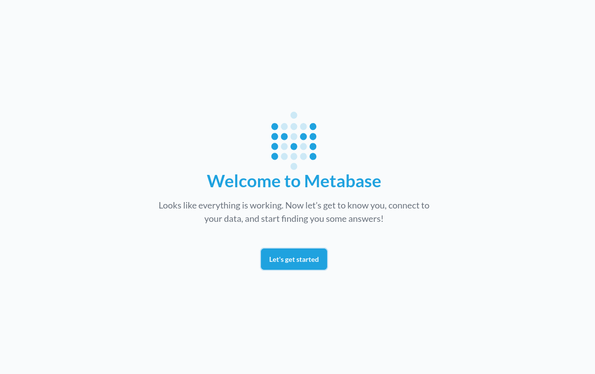
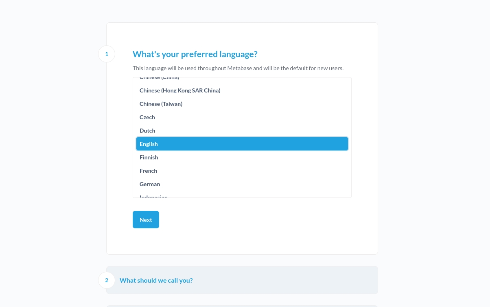
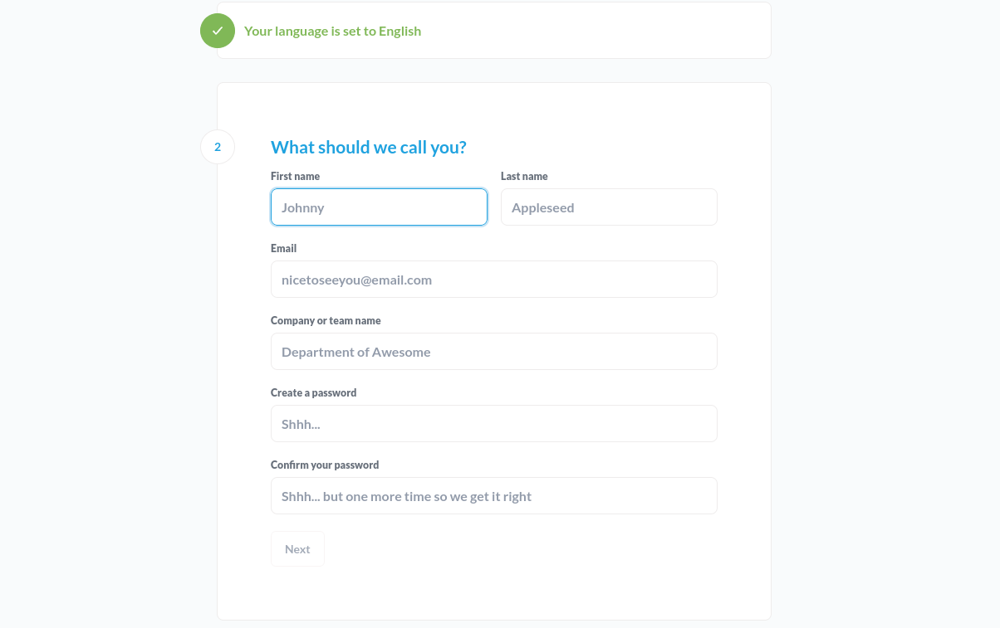
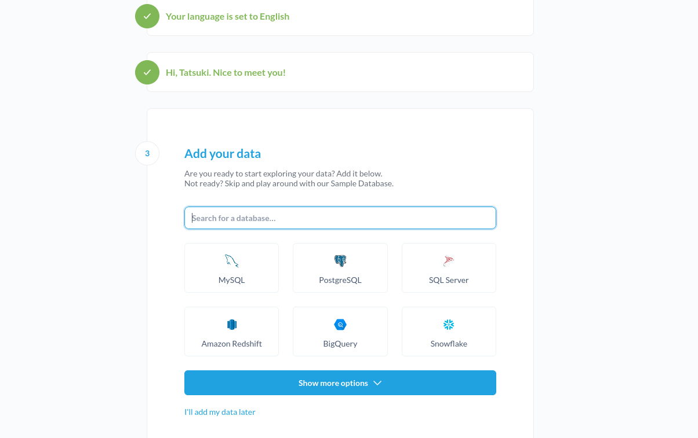
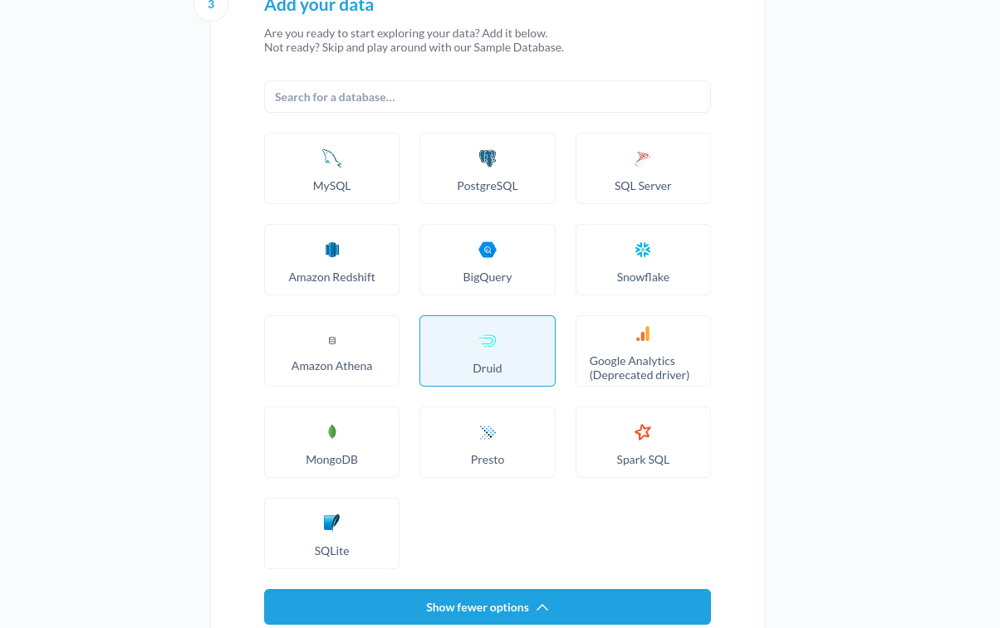
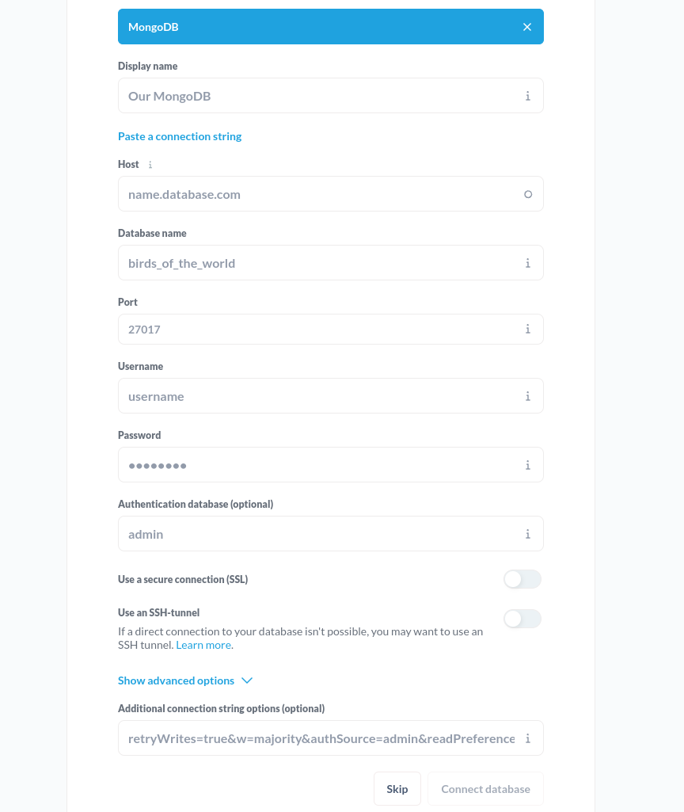
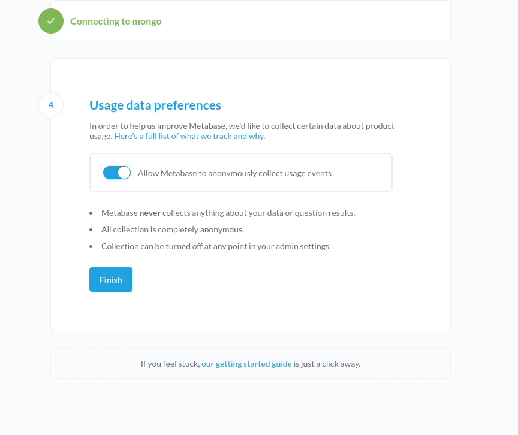
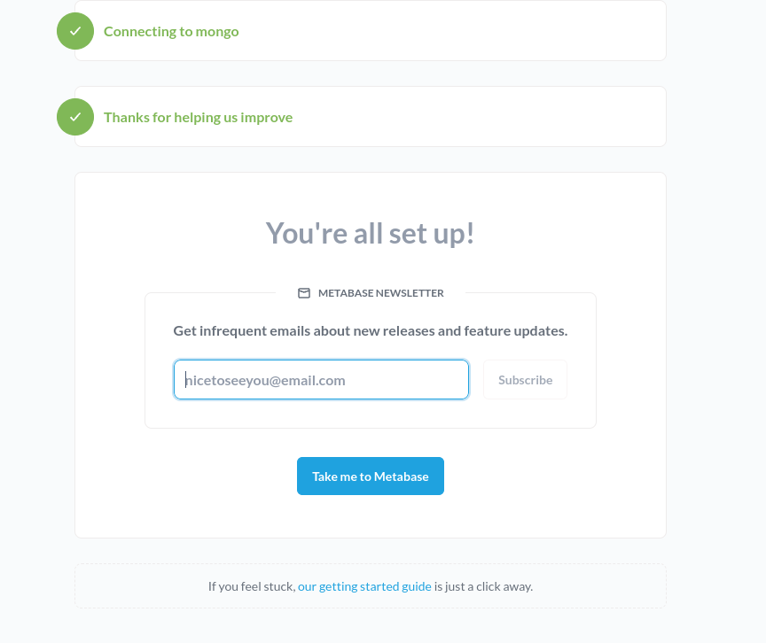

# How to set up Metabase on docker container

### 1. open `0.0.0.0:3000` in browser.
Make sure all containers are up. Maybe it will take a few minutes for Metabase container to finish booting.
click `let's get started` to Metabase set up. 

### 2. choose your preferd language

### 3. fill admin data
fill `First name`, `Last name`, `Email`, `Company or team name` and `password`

### 4. database setting
click `Show more options`

choose `MongoDB`

 
fill MongoDB criteria. Please make sure you use MongoDB container name `mongo` as Host and `27017` as Port. then click `connect database`.

### 5. finish Metabase set up
click `finish`

then click `take me to Metabase` to open Metabase dashboard

Now Metabase set up is done!